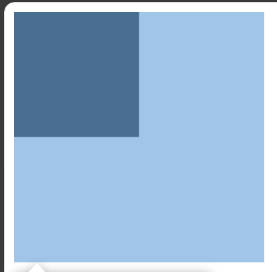
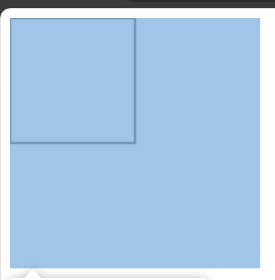
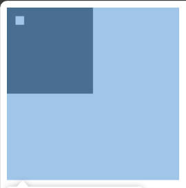
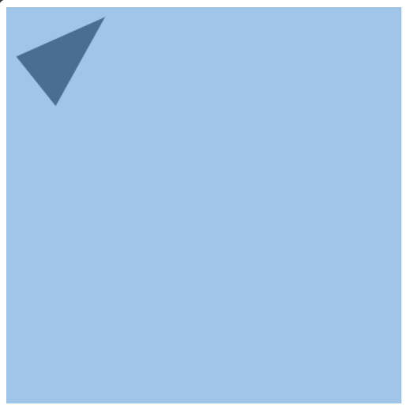
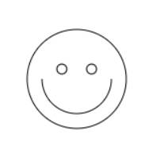
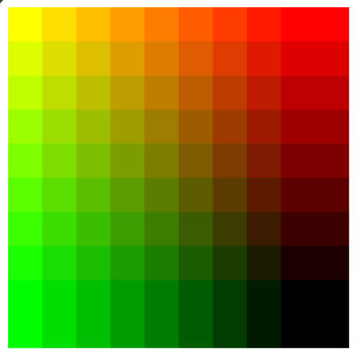
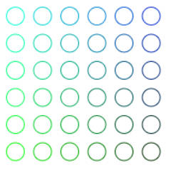
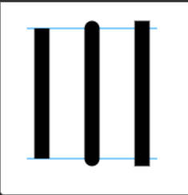
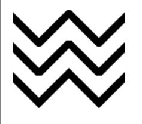

## 基本概念

canvas是一个可以使用脚本（通常为Js）来绘制图形的HTML图形
## 基本用法 
### html + js
```html
<div id="canvas"></div>

<script>

    // 获取canvas（画布）的标签

    const canvas = document.getElementById('canvas')

    // 获取context（画笔）对象

    const context = canvas.getContext('2d')

    // 画出想要的图形 基础

    // 目标：画一个方形 有专门的api -- fillRect(x,y,width,height)

    context.fillRect(100,100,100,400)

</script>
```
```js
// 创建canvas对象
const canvas = document.createElement('')
```
### js（常用）
```js
    // 1.创建canvas(画布)

    const canvas = document.createElement('canvas')

    // 设置宽高

    canvas.height = 500

    canvas.width = 600

    document.body.append(canvas)

    // 2.获取context(画笔)

    const context = canvas.getContext('2d')

    // 3.绘制

    context.fillRect(100,100,100,200)
```
## 绘制图形
### 需知
#### < canvas >元素
* canvas标签只有两个属性 -- height和width 默认宽高为300px 150px
* < /canvas >标签不可省
#### 栅格图形和坐标空间
* canvas元素默认被网格所覆盖 通常来说网格中的一个单元相当于canvas元素中的一像素
#### 支持基础绘图形式
* 不同于svg canvas只支持两种形式的绘图：矩形和路径
### 绘制矩形
* canvas提供了三种绘制矩形的方法
```js
// 1. 绘制一个填充的矩形

canvas.fillRect(x,y,width,height)

// 2. 绘制一个矩形的边框

canvas.strokeRect(x,y,width,height)

// 3. 清除制定矩形区域 让清除部分完全透明

canvas.clearRect(x,y,width,height)

```
* 效果如下
1.  fillRect

1.  strokeRect

1.  fillRect + clearRect

### 绘制路径（直线）
* 图形的基本元素是路径。
* 路径是通过不同颜色和宽度的线段或曲线相连形成的不同形状的点的集合。
* 一个路径，甚至一个子路径，都是闭合的。使用路径绘制图形需要一些额外的步骤。
#### 函数
```js

// 新建一条路径 生成之后图形绘制命令被指向到路径上生成路径

beginPath()

// 闭合路径之后退图形绘制命令又重新回到上下文中

closePath()

*  不是必需调用的
*  如果调用fill函数则会自动闭合图形；调用stroke则不会

// 通过线条来绘制图形轮廓

stroke()

// 通过填充路径的内容区域生成实心的图形

fill()
```
#### 实操
##### 绘制线 -- lineTo
```js

// 从当前位置到坐标为(x,y)指定位置的直线

 context.lineTo(x,y)
```
##### 绘制圆弧 -- arc
```js

// 画一个以（x,y）为圆心的以 radius 为半径的圆弧（圆），从 startAngle 开始到 endAngle 结束，按照 anticlockwise 给定的方向（默认为顺时针）来生成。

context.arc(x,y,radius,startAngle,endAngke,anticlockwise)

 * anticlockwise为一个布尔值 为true时是逆时针 为false时是顺时针
```
> **备注：** `arc()` 函数中表示角的单位是弧度，不是角度。角度与弧度的 js 表达式：
> **弧度 = (Math.PI/180)*角度。**
 
##### 绘制三角形
*  代码
```js
 const canvas = document.createElement('canvas')

    const context = canvas.getContext('2d')

    canvas.height = 400

    canvas.width = 400

    document.body.append(canvas)

    // 创建路径

    context.beginPath()

    // 1.起点 moveTo(x,y)

    context.moveTo(100,10)

    // 2.依次设置途经点

    context.lineTo(10,50)

    context.lineTo(50,100)

    context.fill()
```
* 效果

##### 利用moveTo（移动笔触）的性质绘制笑脸
*  moveTo：一个非常有用的函数，而这个函数实际上并不能画出任何东西，也是上面所描述的路径列表的一部分。
* 当 canvas 初始化或者`beginPath()`调用后，你通常会使用`moveTo()`函数设置起点。我们也能够使用`moveTo()`绘制一些==不连续==的路径。看一下下面的笑脸例子。我将用到`moveTo()`方法（红线处）的地方标记了。
```js
const canvas = document.createElement('canvas')

    const ctx = canvas.getContext('2d')

    canvas.height = 400

    canvas.width = 400

    document.body.append(canvas)

    ctx.beginPath();

    ctx.arc(75, 75, 50, 0, Math.PI * 2, true); // 绘制

    ctx.moveTo(110, 75);

    ctx.arc(75, 75, 35, 0, Math.PI, false); // 口 (顺时针)

    ctx.moveTo(65, 65);

    ctx.arc(60, 65, 5, 0, Math.PI * 2, true); // 左眼

    ctx.moveTo(95, 65);

    ctx.arc(90, 65, 5, 0, Math.PI * 2, true); // 右眼

    ctx.stroke();
```
*  绘制效果

## 应用样式和色彩
### 需知
*  [`fillStyle = color`](https://developer.mozilla.org/zh-CN/docs/Web/API/CanvasRenderingContext2D/fillStyle "fillStyle = color")

设置图形的填充颜色。

* [`strokeStyle = color`](https://developer.mozilla.org/zh-CN/docs/Web/API/CanvasRenderingContext2D/strokeStyle "strokeStyle = color")

设置图形轮廓的颜色。
*  默认情况下 默认线条和填充颜色都是黑色 #000
> 设置 fillStyle 和 strokeStyle 都是全局性的 即只要自定义设置 改颜色就会成为默认颜色 如果要上不同的颜色 就需要重新设置fillStyle和strokeStyle

### CSS颜色标准
对于上述属性的赋值 应该是符合CSS颜色值标准的有效字符串 下面的例子都表示同一颜色
```js
context.fillStyle = 'orange'

context.fillStyle = '#EFA500'

context.fillStyle = 'rgb(255,165,0)'
```
### 色彩
#### fillStyle示例
* 代码
```js
   const canvas = document.createElement('canvas')

    const context = canvas.getContext('2d')

    canvas.height=700

    canvas.width = 700

    document.body.append(canvas)

    // 两层for循环渲染图形

    for(let i = 0;i<10;i++){

      for(let j = 0;j<10;j++){

        // 改变颜色

        context.fillStyle = 'rgb('+Math.floor(255-32.5*i)+','+Math.floor(255-32.5*j)+',0)'

        // 渲染方形

        context.fillRect(j*30,i*30,30,30)

      }

    }
```
* 效果

#### strokeStyle示例
* 代码
```js
 const canvas = document.createElement('canvas')

    const context = canvas.getContext('2d')

    canvas.height = 500

    canvas.width = 500

    document.body.append(canvas)

    for(let i = 0;i<6;i++){

      for(let j = 0;j<6;j++){

        // 改变strokeStyle值

        context.strokeStyle = 'rgb(0,'+ Math.floor(255-42.5*i)+','+Math.floor(255-42.5-42.5*j)+')'

        // 绘制

        context.beginPath()

        context.arc(12.5+30.5*i,12.5+30.5*j,10,0,Math.PI*2,true)

        context.stroke()

      }

    }
```
* 效果

### 透明度
除了可以绘制实色图形，我们还可以用 canvas 来绘制半透明的图形。通过设置 `globalAlpha` 属性或者使用一个半透明颜色作为轮廓或填充的样式。
* 设置globalAlpha
```js
context.globalAlpha = transparentValue
```
* 设置指定透明度颜色
```js

// 指定透明颜色，用于描边和填充样式
ctx.strokeStyle = "rgba(255,0,0,0.5)";
ctx.fillStyle = "rgba(255,0,0,0.5)";

```
### 线型
#### 线条宽度
##### 属性
```js
lineWidth = value
```
##### 案例
```js
const ctx = document.createElement('canvas').getContext('2d')
for(let i = 0;i<8;i++){
  // 每次循环重置线条宽度
  ctx.lineWidth = i+1
  ctx.beginPath()
  ctx.moveTo(5+i*4,5)
  ctx.lineTo(5+i*4,5)
  ctx.stroke()
}
```
#### 线条末端样式
##### 属性
```js
lineCap = type
```
* lineCap的值决定了线段端点显示的样子，取值可为：butt,round,square 默认是butt
##### 案例
```js
ctx.lineCap = 'butt'/'round'/'square'
```

#### 线条与线条间接合处的样式
```js
lineJoin = type
```
* lineJoin的属性值决定了两条线段相交处的样式 取值可为：round,bevel,miter 默认是miter
* round交界处呈圆弧形 bevel呈方形 miter为延伸相交

### 渐变
**可以使用线性或者径向的渐变来填充或者描边**

* [`createLinearGradient(x1, y1, x2, y2)`](https://developer.mozilla.org/zh-CN/docs/Web/API/CanvasRenderingContext2D/createLinearGradient "createLinearGradient(x1, y1, x2, y2)")

createLinearGradient 方法接受 4 个参数，表示渐变的起点 (x1,y1) 与终点 (x2,y2)。

* [`createRadialGradient(x1, y1, r1, x2, y2, r2)`](https://developer.mozilla.org/zh-CN/docs/Web/API/CanvasRenderingContext2D/createRadialGradient "createRadialGradient(x1, y1, r1, x2, y2, r2)")

createRadialGradient 方法接受 6 个参数，前三个定义一个以 (x1,y1) 为原点，半径为 r1 的圆，后三个参数则定义另一个以 (x2,y2) 为原点，半径为 r2 的圆。

```js
var lineargradient = ctx.createLinearGradient(0, 0, 150, 150);
var radialgradient = ctx.createRadialGradient(75, 75, 0, 75, 75, 100);
```
## 文本
[`fillText(text, x, y [, maxWidth])`](https://developer.mozilla.org/zh-CN/docs/Web/API/CanvasRenderingContext2D/fillText "fillText(text, x, y [, maxWidth])")

在指定的 (x,y) 位置填充指定的文本，绘制的最大宽度是可选的。

[`strokeText(text, x, y [, maxWidth])`](https://developer.mozilla.org/zh-CN/docs/Web/API/CanvasRenderingContext2D/strokeText "strokeText(text, x, y [, maxWidth])")

在指定的 (x,y) 位置绘制文本边框，绘制的最大宽度是可选的。

* 文本用当前的填充方式被填充：

```js
function draw() {
  var ctx = document.getElementById("canvas").getContext("2d");
  ctx.font = "48px serif";
  ctx.fillText("Hello world", 10, 50);
}
```
* 文本用当前的边框样式被绘制：
```js
function draw() {
  var ctx = document.getElementById("canvas").getContext("2d");
  ctx.font = "48px serif";
  ctx.strokeText("Hello world", 10, 50);
}
```
#### 有样式的文本
在上面的例子用我们已经使用了 `font` 来使文本比默认尺寸大一些。还有更多的属性可以让你改变 canvas 显示文本的方式：

[`font = value`](https://developer.mozilla.org/zh-CN/docs/Web/API/CanvasRenderingContext2D/font "font = value")

当前我们用来绘制文本的样式。这个字符串使用和 [CSS](https://developer.mozilla.org/zh-CN/docs/Web/CSS) [`font`](https://developer.mozilla.org/zh-CN/docs/Web/CSS/font) 属性相同的语法。默认的字体是 `10px sans-serif`。

[`textAlign = value`](https://developer.mozilla.org/zh-CN/docs/Web/API/CanvasRenderingContext2D/textAlign "textAlign = value")

文本对齐选项。可选的值包括：`start`, `end`, `left`, `right` or `center`. 默认值是 `start`。

[`textBaseline = value`](https://developer.mozilla.org/zh-CN/docs/Web/API/CanvasRenderingContext2D/textBaseline "textBaseline = value")

基线对齐选项。可选的值包括：`top`, `hanging`, `middle`, `alphabetic`, `ideographic`, `bottom`。默认值是 `alphabetic`。

[`direction = value`](https://developer.mozilla.org/zh-CN/docs/Web/API/CanvasRenderingContext2D/direction "direction = value")

文本方向。可能的值包括：`ltr`, `rtl`, `inherit`。默认值是 `inherit`。
